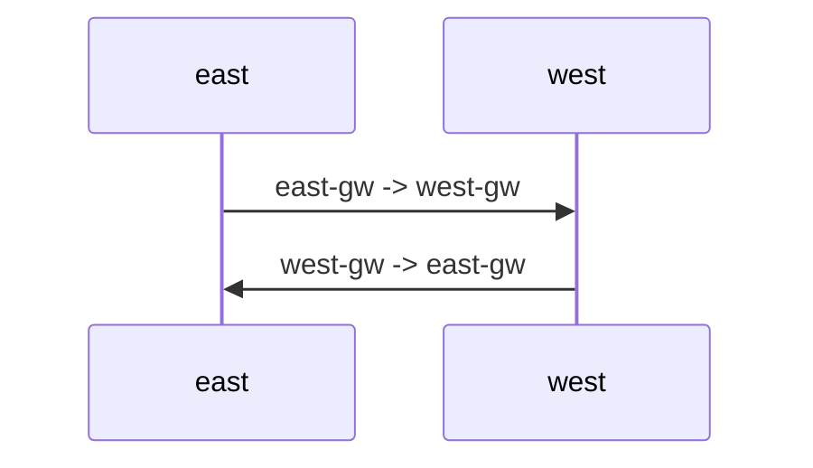
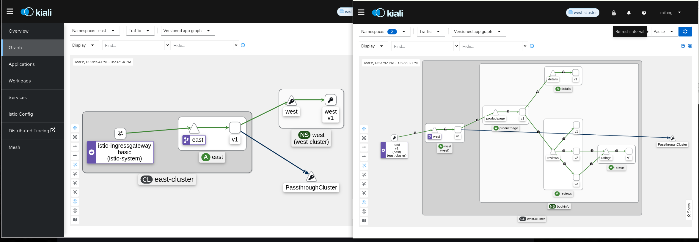
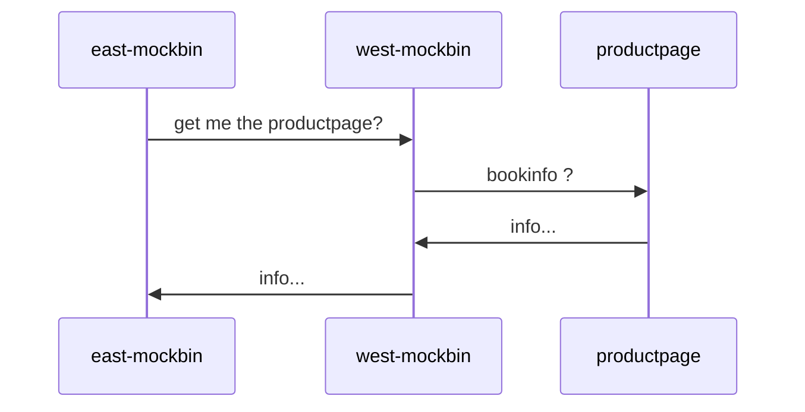
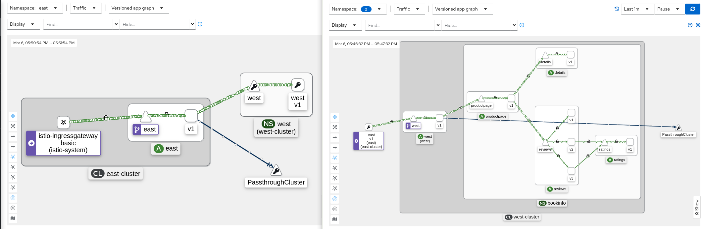
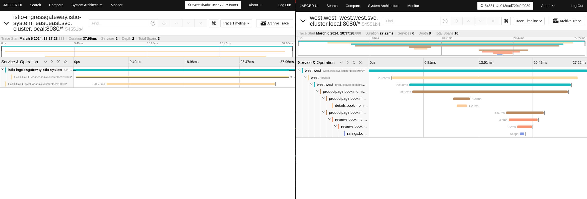

# Multi-cluster Lab 

ServiceMesh brings a lot of benefit into your micro services. Federating multiple meshes is something scaling beyond one cluster boundaries and still you are looking for a more flexible and scale able solution spawning more cluster ? 

Well than let me tell you about a feature called [Multi-cluster](https://istio.io/latest/docs/setup/install/multicluster/multi-primary/). 
Multi-cluster provides us a flexible way to federate two Kubernetes API endpoints for our ServiceMesh. With that we can utilize remote services as if they are deployed locally and even utilize those resources in case the local ones are not available.

Note, this Lab was able to be executed due to the great work of a colleague Jacek Ewertowski.
Most parts are from his brilliant mind and have only be "colored" by me.
Thanks Jacek for your great work on that topic !

# Requirements
The Lab requires you to have two OpenShift clusters. It is possible to use OpenShift Single Node clusters but I recommend to go with at least 24GB memory if you want to utilize the Service Mesh tools Grafana, Kiali, Prometheus, Jaeger.
We create a context for each of the clusters named:
* east 
* west
Further notice that the Lab is based upon Red Hat OpenShift 4.14. Feel free to use any other OpenShift version but ensure to adjust the versions of the Operators accordingly.

If possible select different Service/Podnetwork IP ranges to identify responses easier in later stages.

The Lab also is based on the base domain `example.com` as well as subdomains 
* east.example.com
* west.example.com

References to those names need to be adjusted if you choose to use a different name accordingly.
Furthermore we need the `kube configuration`  for each cluster and context in a separate file. The content of the file is YAML syntax and you can either copy&paste from your existing `~/.kube/config` file 
Note: for simplification I removed the certificate bits and set insecure-skup-tls-verify, your configuration should match the Administrative/RBAC-granted access to the Clusters accordingly.

```
# cat kubeconfig.east
apiVersion: v1
clusters:
- cluster:
    insecure-skip-tls-verify: true
    server: https://api.east.example.com:6443
  name: east
contexts:
- context:
    cluster: east
    namespace: default
    user: east
  name: east
current-context: east
kind: Config
preferences: {}
users:
- name: east
  user:
    client-certificate-data: LS..o=
    client-key-data: LS..g==
```
```
# cat kubeconfig.west
apiVersion: v1
clusters:
- cluster:
    insecure-skip-tls-verify: true
    server: https://api.west.example.com:6443
  name: west
contexts:
- context:
    cluster: west
    namespace: default
    user: west
  name: west
current-context: west
kind: Config
preferences: {}
users:
- name: west
  user:
    client-certificate-data: LS..o=
    client-key-data: LS..g==
```

## Operator installation
for Red Hat OpenShift Service Mesh we need following operators to be available
* Red Hat OpenShift distributed tracing platform (Jaeger)
* Kiali Operator
* Red Hat OpenShift Service Mesh
using the cli we need to create a namespace and an OperatorGroup for the openshift-distributed-tracing operator
```
# cat <<EOF | oc --context east create -f -
apiVersion: v1
kind: Namespace
metadata:
  creationTimestamp: null
  name: openshift-distributed-tracing
spec: {}
---
apiVersion: operators.coreos.com/v1
kind: OperatorGroup
metadata:
  annotations:
    olm.providedAPIs: Jaeger.v1.jaegertracing.io
  generateName: openshift-distributed-tracing-
  name: openshift-distributed-tracing
  namespace: openshift-distributed-tracing
spec:
  upgradeStrategy: Default
EOF
```
```
# cat <<EOF | oc --context west create -f -
apiVersion: v1
kind: Namespace
metadata:
  creationTimestamp: null
  name: openshift-distributed-tracing
spec: {}
---
apiVersion: operators.coreos.com/v1
kind: OperatorGroup
metadata:
  annotations:
    olm.providedAPIs: Jaeger.v1.jaegertracing.io
  generateName: openshift-distributed-tracing-
  name: openshift-distributed-tracing
  namespace: openshift-distributed-tracing
spec:
  upgradeStrategy: Default
EOF
```
afterwards we are adding the Subscriptions for the operators in the requirement list
```
# cat <<EOF | oc --context east create -f -
apiVersion: operators.coreos.com/v1alpha1
kind: Subscription
metadata:
  labels:
    operators.coreos.com/jaeger-product.openshift-distributed-tracing: ""
  name: jaeger-product
  namespace: openshift-distributed-tracing
spec:
  channel: stable
  installPlanApproval: Automatic
  name: jaeger-product
  source: redhat-operators
  sourceNamespace: openshift-marketplace
  startingCSV: jaeger-operator.v1.51.0-1
---
apiVersion: operators.coreos.com/v1alpha1
kind: Subscription
metadata:
  labels:
    operators.coreos.com/kiali-ossm.openshift-operators: ""
  name: kiali-ossm
  namespace: openshift-operators
spec:
  channel: stable
  installPlanApproval: Automatic
  name: kiali-ossm
  source: redhat-operators
  sourceNamespace: openshift-marketplace
  startingCSV: kiali-operator.v1.65.11
---
apiVersion: operators.coreos.com/v1alpha1
kind: Subscription
metadata:
  labels:
    operators.coreos.com/servicemeshoperator.openshift-operators: ""
  name: servicemeshoperator
  namespace: openshift-operators
spec:
  channel: stable
  installPlanApproval: Automatic
  name: servicemeshoperator
  source: redhat-operators
  sourceNamespace: openshift-marketplace
  startingCSV: servicemeshoperator.v2.4.5
---
EOF
```
```
# cat <<EOF | oc --context west create -f -
apiVersion: operators.coreos.com/v1alpha1
kind: Subscription
metadata:
  labels:
    operators.coreos.com/jaeger-product.openshift-distributed-tracing: ""
  name: jaeger-product
  namespace: openshift-distributed-tracing
spec:
  channel: stable
  installPlanApproval: Automatic
  name: jaeger-product
  source: redhat-operators
  sourceNamespace: openshift-marketplace
  startingCSV: jaeger-operator.v1.51.0-1
---
apiVersion: operators.coreos.com/v1alpha1
kind: Subscription
metadata:
  labels:
    operators.coreos.com/kiali-ossm.openshift-operators: ""
  name: kiali-ossm
  namespace: openshift-operators
spec:
  channel: stable
  installPlanApproval: Automatic
  name: kiali-ossm
  source: redhat-operators
  sourceNamespace: openshift-marketplace
  startingCSV: kiali-operator.v1.65.11
---
apiVersion: operators.coreos.com/v1alpha1
kind: Subscription
metadata:
  labels:
    operators.coreos.com/servicemeshoperator.openshift-operators: ""
  name: servicemeshoperator
  namespace: openshift-operators
spec:
  channel: stable
  installPlanApproval: Automatic
  name: servicemeshoperator
  source: redhat-operators
  sourceNamespace: openshift-marketplace
  startingCSV: servicemeshoperator.v2.4.5
---
EOF
```
now wait for the Operators to be deployed 
```
# oc --context east wait clusterserviceversion servicemeshoperator.v2.4.5 --for=jsonpath='{.status.phase}'=Succeeded
# oc --context west wait clusterserviceversion servicemeshoperator.v2.4.5 --for=jsonpath='{.status.phase}'=Succeeded
```
## Certificate Authority 
Feel free to utilize the `example.com` Certificates provided in the Lab or follow the [instructions](https://istio.io/latest/docs/tasks/security/cert-management/plugin-ca-cert/) from upstream to create your own CA.

You should end up with 4 files per cluster 
* ca-cert.pem, the generated intermediate certificates
* ca-key.pem, the generated intermediate key
* cert-chain.pem, the generated certificate chain which is used by istiod
* root-cert.pem, the root certificate

Let's create the `istio-system` namespace and add the certificates we created.
Note that we also label the namespaces with istio topology labels.

```
# oc --context east create namespace istio-system 
# oc --context east label namespace istio-system topology.istio.io/network=network1
# oc --context east -n istio-system create secret generic cacerts \
    --from-file=certs/east/ca-cert.pem \
    --from-file=certs/east/ca-key.pem \
    --from-file=certs/east/root-cert.pem \
    --from-file=certs/east/cert-chain.pem
```
```
# oc --context west create namespace istio-system 
# oc --context west label namespace istio-system topology.istio.io/network=network2
# oc --context west -n istio-system create secret generic cacerts \
    --from-file=certs/east/ca-cert.pem \
    --from-file=certs/east/ca-key.pem \
    --from-file=certs/east/root-cert.pem \
    --from-file=certs/east/cert-chain.pem
```
## ServiceMeshControlPlane configuration

The Lab provided template for the ServiceMeshControlPlane CR expects that the `eastwest-gateway` is available at the corresponding names and NodePorts:
* gw.east.example.com, port 30443
* gw.west.example.com, port 30443

If you are using Red Hat OpenShift on AWS you can use the LoadBalancer created names/ports which will be available after the `istio-eastwestgateway` Service has deployed and claimed those accordingly.
Ensure to adjust the values if you are using a different layout/setup.

```
# oc --context east -n istio-system apply -f smcp-east.yml
```
```
# oc --context west -n istio-system apply -f smcp-west.yml
```

wait for both SMCP's to be rolled out accordingly
```
# oc --context east -n istio-system wait deploy/istiod-basic --for=condition=Available --timeout=300s
```
```
# oc --context west -n istio-system wait deploy/istiod-basic --for=condition=Available --timeout=300s
```
### East-West Gateway configuration

The east-west gateway handles the communication with the other cluster.  For the Lab scaling the gateway similar as ingress/egress gateways isn't necessary but for sure it will be later in the game.
Note the Lab uses `NodePort` for receiving the traffic and using a route is not possible due to the protocol not sending a SNI header.

```
# oc --context east -n istio-system create -f gw-east.yml 
```
```
# oc --context west -n istio-system create -f gw-west.yml
```
#### Granting permissions to the other API server

We now need to grant access to the other cluster API server. Therefor we need to use the kube configuration from the west cluster as secret on the east and vice-versa.

```
# ./generate-kubeconfig.sh \
  --cluster-name=east \
  --namespace=istio-system \
  --revision=basic \
  --remote-kubeconfig-path=kubeconfig.east > istiod-basic-east-cluster.kubeconfig
```
```
# ./generate-kubeconfig.sh \
  --cluster-name=west \
  --namespace=istio-system \
  --revision=basic \
  --remote-kubeconfig-path=kubeconfig.west > istiod-basic-west-cluster.kubeconfig
```
Those configuration will now be added a secret for Istio to be used. The annotations and labels will take care of that.
```
# oc --context east -n istio-system create \
    secret generic istio-remote-secret-west-cluster \
    --from-file=west-cluster=istiod-basic-west-cluster.kubeconfig \
    --type=string
# oc --context east -n istio-system annotate secret istio-remote-secret-west-cluster networking.istio.io/cluster='west-cluster'
# oc --context east -n istio-system label secret istio-remote-secret-west-cluster istio/multiCluster='true'
```
```
# oc --context west -n istio-system create \
    secret generic istio-remote-secret-east-cluster \
    --from-file=east-cluster=istiod-basic-east-cluster.kubeconfig \
    --type=string
# oc --context west -n istio-system annotate secret istio-remote-secret-east-cluster networking.istio.io/cluster='east-cluster'
# oc --context west -n istio-system label secret istio-remote-secret-east-cluster istio/multiCluster='true'
```


## Workload deployments

Even though the bookinfo app is the commonly used one for Service Mesh, I decided to use a mockbin service in addition to simplify and demonstrate the capabilities.
The mockbin service is self-made as I utilize it for various use-cases in relation to Service Mesh. Please feel free to exchange it with a sleep or any other httpbin/mockbin service of your choice.
Note in replacing various outputs might differ or might not be available as described further.
```
# oc --context east create -k mockbin/overlays/east/
# oc --context east -n east create -f mockbin/overlays/east/deploy.yml
```
```
# oc --context west create -k mockbin/overlays/west/
# oc --context west -n west create -f mockbin/overlays/west/deploy.yml
```
```
# oc --context west create namespace bookinfo
# oc --context west label namespace bookinfo istio-injection=enabled
# oc --context west -n bookinfo create \
   -f https://raw.githubusercontent.com/maistra/istio/maistra-2.4/samples/bookinfo/platform/kube/bookinfo.yaml 
```

### verify the deployments 
There is a Bug which you should be aware of if you want to port your own deployment/workloads into the Lab setup.
With `mode: clusterwide` and the `discoverySelector` set, we cannot bind to privileged ports. 
```
warn	buildGatewayListeners: skipping privileged gateway port 80 for node istio-ingressgateway-7dcdffcffb-szxrc.istio-system as it is an unprivileged pod
```

That happens if your Gateway binds to ports <= 1024. The `istiod-basic` logs will show the skipped ports and your ingress will not act as you expect. 
The Gateway definition in this Lab are covering the scenario and for update on the progress of the Bug, please visit the Red Hat issue [OSSM-5556](https://issues.redhat.com/browse/OSSM-5556)

```
# curl -I --cacert mockbin/overlays/east/ca.crt https://mockbin.apps.east.example.com
HTTP/1.1 200 OK
```
```
# curl -I --cacert mockbin/overlays/west/ca.crt https://mockbin.apps.west.example.com 
HTTP/1.1 200 OK
```
```
# oc --context west -n west exec -ti deploy/west -- curl -I productpage.bookinfo:9080/productpage
HTTP/1.1 200 OK
```

## multi-cluster communication verification
With istioctl we will list all known endpoints for the mockbin deployments on the east and the west cluster.

```
# istioctl --context east -n east pc endpoints $(oc --context east get pods -n east -l app=east -o jsonpath='{.items[].metadata.name}')
```
```
# istioctl --context west -n west pc endpoints $(oc --context west get pods -n west -l app=west -o jsonpath='{.items[].metadata.name}')
```
The important part on the output of the istioctl commands above is that you should see at least one endpoint with the IP address of the eastwest gateway of the other cluster. 
```
# example output
ENDPOINT                                                STATUS      OUTLIER CHECK     CLUSTER
10.128.1.194:8080                                       HEALTHY     OK                inbound|8080||
10.128.1.194:8080                                       HEALTHY     OK                outbound|8080||east.east.svc.cluster.local
127.0.0.1:15000                                         HEALTHY     OK                prometheus_stats
127.0.0.1:15020                                         HEALTHY     OK                agent
172.30.64.240:9411                                      HEALTHY     OK                zipkin
192.168.193.241:80                                      HEALTHY     OK                PassthroughCluster
192.168.193.241:30443                                   HEALTHY     OK                outbound|8080||west.west.svc.cluster.local
192.168.193.241:30443                                   HEALTHY     OK                outbound|9080||details.bookinfo.svc.cluster.local
192.168.193.241:30443                                   HEALTHY     OK                outbound|9080||productpage.bookinfo.svc.cluster.local
192.168.193.241:30443                                   HEALTHY     OK                outbound|9080||ratings.bookinfo.svc.cluster.local
192.168.193.241:30443                                   HEALTHY     OK                outbound|9080||reviews.bookinfo.svc.cluster.local
```
in the example the IP address `192.168.193.241:30443` represents the eastwest gateway of the other cluster.

### multi-cluster communication verification for workloads
As mentioned in the beginning, if you are using your own mockbin/httpbin service the output might vary from what you see below.

Let's verify the communication from east cluster service east,  to west cluster service west.
```
# oc --context east -n east exec -ti deploy/east \
  -- curl -s west.west.svc.cluster.local:8080 | jq -r | jq -r '.headers'
{
  "Accept": "*/*",
  "Host": "west.west.svc.cluster.local:8080",
  "User-Agent": "curl/7.76.1",
  "X-B3-Parentspanid": "2fede1635a7c4883",
  "X-B3-Sampled": "1",
  "X-B3-Spanid": "98b2140d89382e38",
  "X-B3-Traceid": "31f366fc378b3ba72fede1635a7c4883",
  "X-Envoy-Attempt-Count": "1",
  "X-Forwarded-Client-Cert": "By=spiffe://cluster.local/ns/west/sa/default;Hash=7ae0a135a40506de173c874a9922493677a2829c204e5822a3747f3eb426500c;Subject=\"\";URI=spiffe://cluster.local/ns/east/sa/default",
  "X-Forwarded-Proto": "http",
  "X-Request-Id": "8a8b83fa-b1b8-93f0-9be0-2915138d8e9d"
}
```
The headers returned show that have a SPIFFE cert header and that we have been moving from east to west. Ignore the other headers for now we will handle them in the distributed tracing section below.

Same for communication from west to east please.
```
# oc --context west -n west exec -ti deploy/west   -- curl -s east.east.svc.cluster.local:8080 | jq -r | jq -r '.headers'
{
  "Accept": "*/*",
  "Host": "east.east.svc.cluster.local:8080",
  "User-Agent": "curl/7.76.1",
  "X-B3-Parentspanid": "7746570d242debdf",
  "X-B3-Sampled": "1",
  "X-B3-Spanid": "ce2c1e47165ebfa1",
  "X-B3-Traceid": "fb669ce5326e51c27746570d242debdf",
  "X-Envoy-Attempt-Count": "1",
  "X-Forwarded-Client-Cert": "By=spiffe://cluster.local/ns/east/sa/default;Hash=a5f57c0a83bdfbfbabf0dbc3b9a0a8a864d653f168b5536bfa439f9476d4619c;Subject=\"\";URI=spiffe://cluster.local/ns/west/sa/default",
  "X-Forwarded-Proto": "http",
  "X-Request-Id": "c625bad3-504f-9670-a79a-8e16f97805aa"
}
```
so far so good ... what about reaching the bookinfo service on the west cluster from east cluster ?
```
# oc --context east -n east exec -ti deploy/east   -- curl -sI productpage.bookinfo:9080/productpage 
HTTP/1.1 200 OK
content-type: text/html; charset=utf-8
content-length: 5290
server: envoy
date: Wed, 06 Mar 2024 16:10:57 GMT
x-envoy-upstream-service-time: 27
```
#### how the communication was flowing in workload verification

Before we look into how this looks in the Kiali UI we first federate the metrics and tracing service of both meshes to proceed further in the UIs.

## Federating tracing and metrics for east and west

The federation is the simplest possible solution and is not meant for production purpose. Furthermore it is currently not supported in that way and we hopefully see some RFE updates on that soon.
Note we are choosing the west cluster to handle the federation so only the west cluster will provide a east->west traffic flow when calling the services later.

```
# oc --context west -n istio-system apply -f metric-federation-west.yml 
```
The patch adds the `remote-write` endpoint in prometheus and exposes a plain-text service for the east cluster to reach.

The east cluster prometheus receives an update on the configuration to write to the new endpoint accordingly.
```
# oc --context east -n istio-system apply -f metric-federation-east.yml 
# oc --context east -n istio-system rollout restart deploy/prometheus
```
After prometheus has restarted, open up and access the Kiali UI.

## Kiali UI east-west traffic visualization
Select the `Graph` menu and pick the namespaces:
* bookinfo
* west 

The picture shows the east cluster on the left hand side and the west cluster on the right hand side. 


Without federating metrics, the east cluster cannot tell anything more than it's reaching the west workload. 
Copy and paste following command into a bash script and execute it while evaluating the Kiali UI
```
# cat <<EOF> generate-traffic.sh
while /bin/true ; do
  curl -o/dev/null -ks https://mockbin.apps.east.example.com/tracefwd \
    -H 'Content-Type: application/json' \
    -d'[{"url":"http://west.west.svc.cluster.local:8080/tracefwd","method":"GET","headers":{}},{"url":"http://productpage.bookinfo:9080/productpage","method":"GET","headers":{}}]'
  sleep .1
done
EOF
# sh generate-traffic.sh
```
The mockbin service on the east cluster will receive a request, forward the request to the mockbin service on the west cluster. The west cluster mockbin service will again forward the request to the bookinfo page returning the result back to the east cluster.


in the Kiali UI iw till look like


## SPIFFY and RBAC in multi-cluster setups

In Federation we lack the ability to have SPIFFE identifiers from the other cluster to authenticate requests as we are used to in Service Mesh.
Multi-cluster does forward SPIFFE so we can restrict who from cluster east can access the bookinfo application.
```
# oc --context west -n bookinfo apply -f rbac-bookinfo.yml
```
The RBAC restricts access to the principal in the west cluster `cluster.local/ns/west/sa/default` 
```
# oc --context east -n east exec -ti deploy/east -- curl productpage.bookinfo:9080 -I 
HTTP/1.1 403 Forbidden

# oc --context west -n west exec -ti deploy/west -- curl productpage.bookinfo:9080 -I
HTTP/1.1 200 OK
```
We can also grant the east cluster east principal to access the bookinfo service 
```
# oc --context west -n bookinfo apply -f rbac-east-bookinfo.yml
```
Now that we added the principal `cluster/local/ns/east/sa/default` we expect a positive response for both requests
```
# oc --context east -n east exec -ti deploy/east -- curl productpage.bookinfo:9080 -I 
HTTP/1.1 200 OK
# oc --context west -n west exec -ti deploy/west -- curl productpage.bookinfo:9080 -I
HTTP/1.1 200 OK
```
Note, since we do not have different base identifiers but share `cluster.local` deploying the mockbin west workload on the east cluster will grant the workload automatically access due to the same SPIFFE identifier.
Deploy the mockbin west service to the east cluster 
```
# oc --context east -n west apply -f mockbin/overlays/west/deploy.yml 
```
Verify the SPIFFE and RBAC access
```
# oc --context east -n west exec -ti deploy/west -- curl -sI productpage.bookinfo:9080 
HTTP/1.1 200 OK
```

## HA and workload failover in multi-cluster setups

The scenario requires that you have execute the deployment of the west cluster mockbin service on to the east cluster.
Following script will execute a request to the west mockbin service and based upon the response return which cluster was responding even though, we utilize only one ingress (west).

Note, the two OCP Clusters have to be setup with different Service/Podnetwork ranges to identify the response easily. (172.30 and 172.40)
```
# cat <<EOF> multi-traffic.sh
while /bin/true ; do
    curl -sk https://mockbin.apps.east.example.com/tracefwd \
      -H 'Content-Type: application/json' \
      -d '[{"url":"http://west.west:8080","method":"GET","headers":{}}]' | \
      jq -r | jq -r '.response.env.WEST_SERVICE_HOST' | \
      grep -q '172.40' && echo "remote" || echo "local" 
    sleep .1 
done
EOF
```
Executing the script will return the response of `local` or `remote` based upon the IP Address found in the kubernetes environment `WEST_SERVICE_HOST` of each deployment.
```
#  sh multi-traffic.sh 
local
local
remote
remote
remote
remote
remote
local
local
```
Now lets terminate the service on the east cluster while continue to execute the `multi-traffic.sh` script.
```
# oc --context east -n west scale --replicas=0 deploy/west
```
the script should immediately only return the remote response afterwards
```
local
remote
local
remote
remote
remote
local
local
remote
remote
remote
remote
remote
remote
remote
...
```
scaling the service back up will take it in to the loop again without further action
```
# oc --context east -n west scale --replicas=1 deploy/west
```
and if we terminate the west cluster service instead ?
```
# oc --context west -n west scale --replicas=0 deploy/west
```
it will return only the east cluster resources transparently
```
local
remote
remote
local
local
local
local
local
local
local
local
...
```
## distributed tracing in multi-cluster
We will now borrow one request from the `generate-traffic.sh` script to execute a call spawning all services from both clusters.
Note the traceid will be different in your request
```
# curl -ks https://mockbin.apps.east.example.com/tracefwd \
  -H 'Content-Type: application/json' \
  -d '[{"url":"http://west.west.svc.cluster.local:8080/tracefwd","method":"GET","headers":{}},{"url":"http://productpage.bookinfo:9080/productpage","method":"GET","headers":{}}]'
```
That command will return with the output of the productpage from the bookinfo app and in the very end it will as well print the generated traceid.

```
</body>\n</html>\n","status":"OK","traceid":"54551b4d013cad729c9f908925b05c65"},"status":"OK","traceid":"54551b4d013cad729c9f908925b05c65"}
```

Open up the Jaeger UI in both clusters to see the difference of content as the east cluster lacks all traces happening in the west cluster but the west cluster has east cluster traces due to federating the service.


# conclusion
All in all, the current versions of Red Hat Openshift, Red Hat OpenShift distributed tracing platform, Red Hat OpenShift Service Mesh do provide a lot of flexibility and integration for multi-cluster setups. We will hopefully see those as Developer preview soon and if you have followed along until here, please share your issue and improvements with the community to improve the great experience that's already available.
